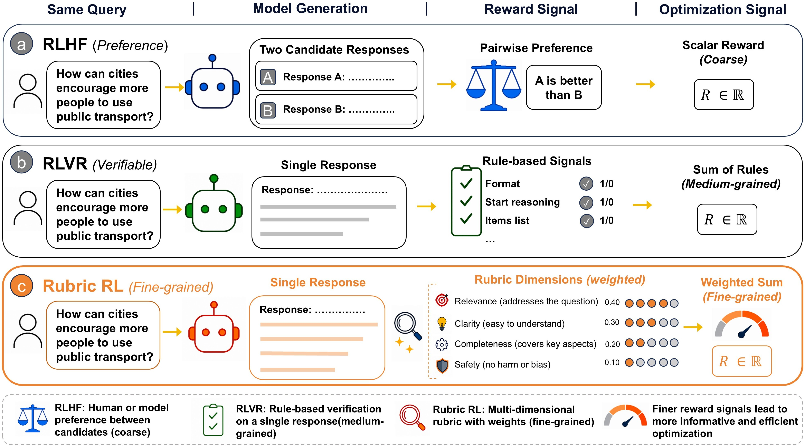
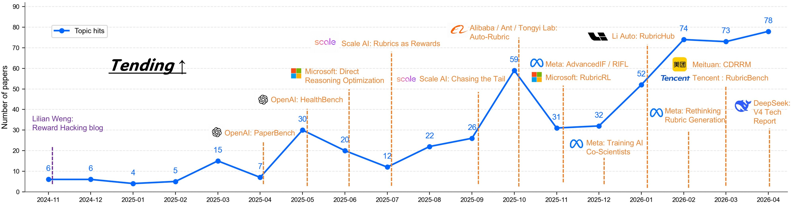
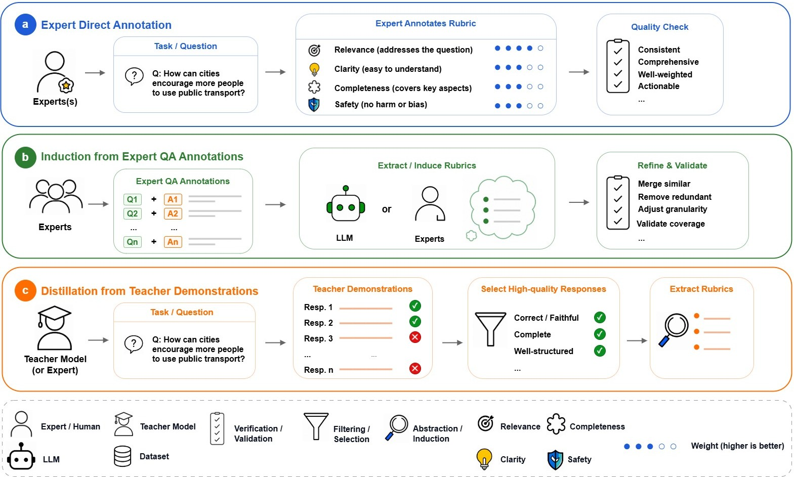

<h1 align="center">Awesome Rubrics</h1>

<p align="center">
  <a href="#"></a>
  <a href="https://github.com/sindresorhus/awesome"></a>
  <a href="https://GitHub.com/Naereen/StrapDown.js/graphs/commit-activity"></a>
  <a href="http://makeapullrequest.com"></a>
</p>

<p align="center">
  A curated reading list on <b>rubric-based evaluation, reward modeling, and post-training for large models</b>.
  <br>
  Rubrics turn expert judgment into structured criteria, auditable LLM judges, and trainable reward signals.
</p>

---

<p align="center">
  <a href="#what-are-rubrics">What are Rubrics?</a> ·
  <a href="#why-rubrics-matter-now">Why Rubrics Matter</a> ·
  <a href="#repository-map">Repository Map</a> ·
  <a href="#table-of-contents">Table of Contents</a>
</p>

Papers with publicly released code or project resources include an inline `[[Code](...)]` link. Entries without verified repositories omit that link.

> Contributions are welcome. If you find missing papers, inaccurate classifications, or newly released code, feel free to update this list.

## What are Rubrics?

In the context of LLM evaluation and alignment, a **rubric** is a structured set of criteria for judging open-ended model outputs. Instead of asking a human or LLM judge for one vague preference, rubrics decompose quality into explicit dimensions, scoring rules, and evidence requirements.

Rubrics make subjective judgment more inspectable:

- **What to judge**: relevance, factuality, completeness, safety, reasoning quality, style, or domain-specific standards.
- **How to judge**: score levels, checklists, pairwise criteria, evidence anchors, or weighted dimensions.
- **How to use the judgment**: evaluation reports, LLM-as-a-Judge protocols, reward models, preference tuning, policy optimization, and curriculum learning.

<p align="center">
  
</p>

<p align="center"><i>Figure 1. Rubrics convert coarse feedback into fine-grained, inspectable reward signals.</i></p>

| Feedback style | Typical signal | Best fit | Main limitation |
|---|---|---|---|
| **RLHF / model-based preference** | "Output A is better than output B." | Open-ended comparison | Coarse and hard to inspect |
| **RLVR / rule-based reward** | Format is correct, answer matches, reasoning token appears, list structure exists | Verifiable tasks | Too rigid for subjective or open-ended tasks |
| **Rubric-based feedback** | Relevance, completeness, clarity, safety, each scored separately | Open-ended evaluation and training | Requires careful design and calibration |

Rubrics are the middle layer: more structured than model-only preference, more flexible than hard rules.

## Why Rubrics Matter Now

> "In this new era, evaluation becomes more important than training."
>
> - Shunyu Yao, [*The Second Half* (2025)](https://ysymyth.github.io/The-Second-Half/)

As large models move from closed-form QA to open-ended reasoning, agents, multimodal generation, and professional domains, progress is increasingly bottlenecked by **evaluation and feedback design**. Training can optimize only what the system can measure, and many important tasks cannot be reduced to a single scalar reward.

| Rubrics help answer | Why it matters |
|---|---|
| **What counts as good behavior?** | They define explicit criteria, scoring boundaries, and failure modes. |
| **How can expert judgment scale?** | They convert tacit standards into reusable evaluation instructions and datasets. |
| **How can LLM-as-a-Judge become less opaque?** | Judges can be required to expose criteria, evidence, scores, and rationales. |
| **How does evaluation become training signal?** | Rubric-level feedback can supervise SFT, preference tuning, policy optimization, reward modeling, and curriculum learning. |

Rubrics therefore act as a bridge between **human standards** and **machine-optimizable signals**. They are not merely annotation templates; they are a control surface for evaluation, reward modeling, and post-training.


## Growing Research Momentum

<p align="center">
  
</p>

<p align="center"><i>Figure 2. The number of rubric-related papers has grown rapidly, suggesting increasing research attention to structured evaluation and reward design.</i></p>

The rising trend shows that rubric-based methods are becoming an increasingly important direction for large-model alignment, especially as evaluation, reward modeling, and post-training move toward more structured and auditable feedback.


## From Evaluation to Reward

Evaluation is no longer only a post-hoc metric. It is becoming part of the **infrastructure of AI systems**:

```text
🧑‍⚖️ Expert Standards → 📋 Rubrics → 📊 Evaluation Signals → 🎯 Rewards → 🔁 Training Dynamics
```

Rubrics are therefore not just for judging model outputs. They are a way to **automate parts of expert feedback**: experts define criteria, models apply them at scale, and failures reveal where the rubric or judge must be revised. In this sense, evaluation becomes an executable form of domain knowledge.

## A Minimal Rubric Example

For the query:

```text
How can cities encourage more people to use public transport?
```

a rubric does not directly ask "which answer is better?" It decomposes the judgment:

| Component | What the judge checks |
|---|---|
| **Relevance** | Does the answer address public transport adoption rather than unrelated urban issues? |
| **Clarity** | Is the answer easy to understand and well organized? |
| **Completeness** | Does it cover affordability, convenience, infrastructure, reliability, and incentives? |
| **Safety / fairness** | Does it avoid harmful, biased, or exclusionary suggestions? |

This makes the reward more interpretable, decomposable, and actionable.

## Rubric Generation Strategies

<p align="center">
  
</p>

<p align="center"><i>Figure 3. Rubric construction paradigms for large model alignment.</i></p>

| Strategy | Core idea | When it is useful |
|---|---|---|
| **Expert direct annotation** | Experts write criteria explicitly. | High-stakes domains and seed rubrics |
| **Induction from expert QA annotations** | Criteria are extracted from annotated examples. | Scaling expert knowledge beyond manual templates |
| **Distillation from teacher demonstrations** | Rubrics are derived from high-quality model outputs. | Bootstrapping scalable reward signals |

Together, these strategies show how rubric construction moves from manual specification toward data-driven induction and model-driven distillation.


## Repository Map

This repository is organized as a **conceptual map** of rubric-related research. We group papers by the role rubrics play in the large-model pipeline.

This organization helps show rubrics not only as evaluation tools, but also as structured interfaces connecting **expert standards**, **feedback data**, **reward signals**, **training objectives**, and **deployment-time assessment**.

| Section | Role in the repository |
|---|---|
| **Foundations** | Introduces what counts as a rubric, how rubric formats differ from preferences, rules, or scalar scores, and why structured criteria become useful in large-model settings. |
| **Data** | Covers how rubrics are collected, generated, refined, and organized into reusable supervision signals through human annotation, synthetic generation, expert labeling, and rubric datasets. |
| **Training** | Summarizes how rubric-level judgments can be transformed into SFT data, preference objectives, RL rewards, curriculum signals, and self-improvement loops. |
| **Evaluation** | Connects rubrics to LLM-as-a-judge protocols, benchmark design, calibration, reliability analysis, and robustness checks, where explicit and auditable criteria are especially important. |
| **Applications** | Shows how rubric-based methods extend beyond text QA to multimodal tasks, agent systems, and professional domains that require domain-specific standards. |

Overall, this structure follows the lifecycle of rubric-based large-model alignment:

**Define criteria → collect or generate rubric data → train with rubric signals → evaluate with structured judges → apply in domain-specific tasks**

> Rubrics provide a structured layer for connecting data, training, evaluation, and applications.


## Table of Contents

<details open>
<summary>Browse the reading list</summary>

- [Foundations of Rubric](#foundations-of-rubric-based-evaluation)
  - [Rubric Definitions and Boundaries](#rubric-definitions-and-boundaries)
  - [Rubric Representation and Scoring Schemas](#rubric-representation-and-scoring-schemas)
  - [Traditional Domain Usage](#traditional-domain-usage)
  - [Why Foundation Models Need Rubrics](#why-foundation-models-need-rubrics)
- [Rubrics for Foundation-Model Alignment and Evaluation](#rubrics-for-foundation-model-alignment-and-evaluation)
  - [Rubric Construction and Data Sources](#rubric-construction-and-data-sources)
    - [Synthetic Rubric Generation](#synthetic-rubric-generation)
    - [Human- and Expert-Grounded Rubric Data](#human--and-expert-grounded-rubric-data)
  - [Rubric-Guided Training and Post-Training](#rubric-guided-training-and-post-training)
    - [Pre-training](#pre-training)
    - [Post-training](#post-training)
      - [Rubric-Guided Supervised Fine-Tuning](#rubric-guided-supervised-fine-tuning)
      - [Rubric-Guided Preference Tuning](#rubric-guided-preference-tuning)
      - [Rubric-Aware Policy Optimization](#rubric-aware-policy-optimization)
      - [Rubric-Based Reward Modeling and Signal Design](#rubric-based-reward-modeling-and-signal-design)
      - [Rubric-Structured Curriculum Learning](#rubric-structured-curriculum-learning)
      - [Rubric-Guided Self-Improvement](#rubric-guided-self-improvement)
  - [Rubric-Based Evaluation](#rubric-based-evaluation)
    - [Evaluation Methods](#evaluation-methods)
      - [LLM-as-a-Judge and Reward Reasoning](#llm-as-a-judge-and-reward-reasoning)
      - [Statistical and Uncertainty-Aware Evaluation](#statistical-and-uncertainty-aware-evaluation)
    - [Rubric-Based Evaluation Benchmarks](#rubric-based-evaluation-benchmarks)
- [Application Settings of Rubrics](#application-settings-of-rubrics)
  - [Rubrics Across Modalities](#rubrics-across-modalities)
    - [Text Modality](#text-modality)
    - [Vision Modality](#vision-modality)
    - [Audio Modality](#audio-modality)
  - [Rubrics Across Domains](#rubrics-across-domains)
    - [Medical](#medical)
    - [Software Engineering and Code Agents](#software-engineering-and-code-agents)
    - [Agentic Tasks](#agentic-tasks)

</details>

---

> Papers with publicly released code are marked with 🌟.

## Foundations of Rubric-Based Evaluation

### Rubric Definitions and Boundaries
> Rubrics define structured evaluation dimensions, scoring rules, and judgment boundaries for open-ended model outputs. This section covers work that clarifies what counts as a rubric and how rubrics function as judges or reward criteria.

#### 2025
- 🌟 [[arXiv 2025.10](https://arxiv.org/abs/2510.17314)] From Implicit Weights to Explicit Rubrics: A Training-Free Framework for Reward Modeling [[Code](https://github.com/agentscope-ai/OpenJudge)] <br>
     
- [[ICLR 26](https://openreview.net/forum?id=c1bTcrDmt4)] Rubrics as Rewards: Reinforcement Learning Beyond Verifiable Domains [[Data](https://huggingface.co/collections/ScaleAI/rar)] <br>
   

#### 2024
- [[Blog 2024.11](https://lilianweng.github.io/posts/2024-11-28-reward-hacking/)] Reward Hacking in Reinforcement Learning <br>
  

### Rubric Representation and Scoring Schemas

> This section focuses on how rubrics are expressed, including dimensions, levels, weights, and scoring templates. It is useful for understanding the representational form that makes rubric-based supervision reusable and controllable.


#### 2026
- [[arXiv 2026.03](https://arxiv.org/abs/2603.07019)] AutoChecklist: Composable Pipelines for Checklist Generation and Scoring with LLM-as-a-Judge <br>
    

#### 2025
- 🌟 [[arXiv 2025.10](https://arxiv.org/abs/2510.17314)] From Implicit Weights to Explicit Rubrics: A Training-Free Framework for Reward Modeling [[Code](https://github.com/agentscope-ai/OpenJudge)] <br>
     

### Traditional Domain Usage

- No retained papers after full-text justification review.

### Why Foundation Models Need Rubrics

#### 2025
- 🌟 [[ICLR 26](https://openreview.net/forum?id=pBjy4ek2QV)] Chasing the Tail: Effective Rubric-based Reward Modeling for Large Language Model Post-Training [[Code](https://github.com/Jun-Kai-Zhang/rubrics)] <br>
  

## Rubrics for Foundation-Model Alignment and Evaluation

### Rubric Construction and Data Sources

#### Synthetic Rubric Generation

> Synthetic rubric generation uses generated tasks, labels, critiques, or rubric annotations to expand supervision beyond limited human labeling. It is especially useful when rubric-style feedback can be programmatically produced at scale for reward modeling or post-training.

##### 2026

- 🌟 [[arXiv 2026.02](https://arxiv.org/abs/2602.09653)] ClinAlign: Scaling Healthcare Alignment from Clinician Preference [[Code](https://github.com/AQ-MedAI/ClinAlign)] <br>
   
- 🌟 [[arXiv 2026.01](https://arxiv.org/abs/2601.08430)] RubricHub: A Comprehensive and Highly Discriminative Rubric Dataset via Automated Coarse-to-Fine Generation [[Code](https://github.com/teqkilla/RubricHub)] <br>
   

##### 2025
- [[arXiv 2025.10](https://arxiv.org/abs/2510.07743)] OpenRubrics: Towards Scalable Synthetic Rubric Generation for Reward Modeling and LLM Alignment [[Data](https://huggingface.co/datasets/OpenRubrics/OpenRubrics)] <br>
    
- 🌟 [[ICLR 26](https://openreview.net/forum?id=vFcm5sOitq)] OptimSyn: Influence-Guided Rubrics Optimization for Synthetic Data Generation [[Code](https://github.com/FanZT6/OptimSyn)] <br>
  
- [[ICLR 26](https://openreview.net/forum?id=c1bTcrDmt4)] Rubrics as Rewards: Reinforcement Learning Beyond Verifiable Domains [[Data](https://huggingface.co/collections/ScaleAI/rar)] <br>
   

#### Human- and Expert-Grounded Rubric Data

> Human- and expert-grounded rubric data refers to signals from human preferences, authentic interactions, or domain specialists. These sources are important when alignment targets depend on nuanced standards that are hard to synthesize fully.

##### 2026

- 🌟 [[arXiv 2026.04](https://arxiv.org/abs/2604.02368)] Xpertbench: Expert Level Tasks with Rubrics-Based Evaluation [[Code](https://github.com/randomtutu/Xpertbench)] <br>
    
- 🌟 [[arXiv 2026.03](https://arxiv.org/abs/2603.07244)] PresentBench: A Fine-Grained Rubric-Based Benchmark for Slide Generation [[Code](https://github.com/PresentBench/PresentBench)] <br>
   
- 🌟 [[arXiv 2026.03](https://arxiv.org/abs/2603.27646)] PRBench: End-to-end Paper Reproduction in Physics Research [[Code](https://github.com/HET-AGI/PRBench-Eval-Handson)] <br>
   
- [[arXiv 2026.01](https://arxiv.org/abs/2601.18706)] Health-SCORE: Towards Scalable Rubrics for Improving Health-LLMs <br>
   


##### 2025

- [[arXiv 2025.10](https://arxiv.org/abs/2510.22143)] Benchmarking and Learning Real-World Customer Service Dialogue <br>
   
- 🌟 [[ICLR 26](https://openreview.net/forum?id=QOWYX3Q2XS)] MENLO: From Preferences to Proficiency - Evaluating and Modeling Native-like Quality Across 47 Languages [[Code](https://huggingface.co/datasets/facebook/menlo)] <br>
  
- 🌟 [[arXiv 2025.05](https://arxiv.org/abs/2505.08775)] HealthBench: Evaluating Large Language Models Towards Improved Human Health [[Code](https://github.com/openai/simple-evals)] <br>
    
- 🌟 [[arXiv 2025.04](https://arxiv.org/abs/2504.01848)] PaperBench: Evaluating AI's Ability to Replicate AI Research [[Code](https://github.com/openai/preparedness/tree/main/project/paperbench)] <br>
   


### Rubric-Guided Training and Post-Training

#### Pre-training

- No retained papers after full-text justification review.

#### Post-training

##### Rubric-Guided Supervised Fine-Tuning

> Rubrics can be used in supervised fine-tuning for filtering data, weighting samples, or imposing structured response preferences. This makes SFT more aligned with multi-dimensional quality targets instead of flat imitation alone.

###### 2025
- [[ICLR 26](https://openreview.net/forum?id=hXNApWLBZG)] P-GenRM: Personalized Generative Reward Model with Test-time User-based Scaling <br>
   

##### Rubric-Guided Preference Tuning

> Direct preference-learning methods use rubric signals to construct, weight, or structure preference objectives, including DPO-style and preference-tuning approaches.

###### 2026
- 🌟 [[arXiv 2026.03](https://arxiv.org/abs/2603.21362)] AdaRubric: Task-Adaptive Rubrics for LLM Agent Evaluation [[Code](https://github.com/alphadl/AdaRubrics)] <br>
    

###### 2025
- [[arXiv 2025.10](https://arxiv.org/abs/2510.07743)] OpenRubrics: Towards Scalable Synthetic Rubric Generation for Reward Modeling and LLM Alignment [[Model](https://huggingface.co/OpenRubrics/models)] <br>
    
- [[arXiv 2025.08](https://arxiv.org/abs/2508.03990)] Are Today's LLMs Ready to Explain Well-Being Concepts? <br>
   
- [[ICML-W](https://openreview.net/forum?id=seA8en4ujl)] Configurable Preference Tuning with Rubric-Guided Synthetic Data <br>
  

##### Rubric-Aware Policy Optimization

> RL post-training methods modify policy optimization, advantage estimation, exploration, or training stability when rewards are rubric-based or multi-dimensional.

###### 2026
- 🌟 [[arXiv 2026.04](https://arxiv.org/abs/2604.02795)] Rubrics to Tokens: Bridging Response-level Rubrics and Token-level Rewards in Instruction Following Tasks [[Code](https://github.com/TURLEing/Rubrics-To-Tokens)] <br>
   
- [[arXiv 2026.03](https://arxiv.org/abs/2603.15434)] Listening to the Echo: User-Reaction Aware Policy Optimization via Scalar-Verbal Hybrid Reinforcement Learning <br>
  
- [[arXiv 2026.03](https://arxiv.org/abs/2603.15646)] Alternating Reinforcement Learning with Contextual Rubric Rewards <br>
  
- 🌟 [[arXiv 2026.03](https://arxiv.org/abs/2603.20046)] Experience is the Best Teacher: Motivating Effective Exploration in Reinforcement Learning for LLMs [[Code](https://github.com/sikelifei/HeRL)] <br>
  
- 🌟 [[arXiv 2026.03](https://arxiv.org/abs/2603.26535)] PAPO: Stabilizing Rubric Integration Training via Decoupled Advantage Normalization [[Code](https://github.com/tanzelin430/PAPO)] <br>
  
- [[arXiv 2026.02](https://arxiv.org/abs/2602.01511)] Alternating Reinforcement Learning for Rubric-Based Reward Modeling in Non-Verifiable LLM Post-Training [[Model](https://huggingface.co/collections/OpenRubrics/rubricarm)] <br>
   
- [[arXiv 2026.02](https://arxiv.org/abs/2602.07594)] Learning to Self-Verify Makes Language Models Better Reasoners <br>
  
- 🌟 [[arXiv 2026.02](https://arxiv.org/abs/2602.12268)] CM2: Reinforcement Learning with Checklist Rewards for Multi-Turn and Multi-Step Agentic Tool Use [[Code](https://github.com/namezhenzhang/CM2-RLCR-Tool-Agent)] <br>
   
- 🌟 [[arXiv 2026.02](https://arxiv.org/abs/2602.14069)] Open Rubric System: Scaling Reinforcement Learning with Pairwise Adaptive Rubric [[Code](https://github.com/Qwen-Applications/OpenRS)] <br>
   
- 🌟 [[arXiv 2026.01](https://arxiv.org/abs/2601.06021)] Chaining the Evidence: Robust Reinforcement Learning for Deep Search Agents with Citation-Aware Rubric Rewards [[Code](https://github.com/THUDM/CaRR)] <br>
   
- [[arXiv 2026.01](https://arxiv.org/abs/2601.05242)] GDPO: Group reward-Decoupled Normalization Policy Optimization for Multi-reward RL Optimization [[Proj](https://nvlabs.github.io/GDPO/)] <br>
  

###### 2025
- [[arXiv 2025.08](https://arxiv.org/abs/2508.07768)] Pareto Multi-Objective Alignment for Language Models <br>
  
- [[arXiv 2025.06](https://arxiv.org/abs/2506.13351)] Direct Reasoning Optimization: Constrained RL with Token-Level Dense Reward and Rubric-Gated Constraints for Open-ended Tasks <br>
  
- 🌟 [[arXiv 2025.08](https://arxiv.org/abs/2508.16949)] Breaking the Exploration Bottleneck: Rubric-Scaffolded Reinforcement Learning for General LLM Reasoning [[Code](https://github.com/IANNXANG/RuscaRL)] <br>
  
- [[arXiv 2025.09](https://arxiv.org/abs/2509.22611)] Quantile Advantage Estimation: Stabilizing RLVR for LLM Reasoning <br>
  
- [[arXiv 2025.10](https://arxiv.org/abs/2510.11184)] Reinforcement Learning for Tool-Integrated Interleaved Thinking towards Cross-Domain Generalization <br>
   
- [[arXiv 2025.11](https://arxiv.org/abs/2511.12344)] Reward and Guidance through Rubrics: Promoting Exploration to Improve Multi-Domain Reasoning <br>
  


##### Rubric-Based Reward Modeling and Signal Design

> Methods in this section design, generate, calibrate, or densify rubric-based reward signals, including reward models, LLM judges, checklist rewards, and rubric-to-token supervision.

###### 2026
- [[Tech Report 2026.04](https://huggingface.co/deepseek-ai/DeepSeek-V4-Pro/blob/main/DeepSeek_V4.pdf)] DeepSeek-V4: Towards Highly Efficient Million-Token Context Intelligence [[Model](https://huggingface.co/deepseek-ai/DeepSeek-V4-Pro)] <br>
  
- 🌟 [[arXiv 2026.04](https://arxiv.org/abs/2604.02795)] Rubrics to Tokens: Bridging Response-level Rubrics and Token-level Rewards in Instruction Following Tasks [[Code](https://github.com/TURLEing/Rubrics-To-Tokens)] <br>
   
- 🌟 [[arXiv 2026.03](https://arxiv.org/abs/2603.08035)] CDRRM: Contrast-Driven Rubric Generation for Reliable and Interpretable Reward Modeling [[Code](https://github.com/ldcan/CDRRM)] <br>
   
- 🌟 [[arXiv 2026.03](https://arxiv.org/abs/2603.01562)] RubricBench: Aligning Model-Generated Rubrics with Human Standards [[Code](https://github.com/planepig/rubricbench)] <br>
   
- 🌟 [[arXiv 2026.03](https://arxiv.org/abs/2603.07019)] AutoChecklist: Composable Pipelines for Checklist Generation and Scoring with LLM-as-a-Judge [[Code](https://github.com/ChicagoHAI/AutoChecklist)] <br>
    
- [[arXiv 2026.03](https://arxiv.org/abs/2603.20882)] RubricRAG: Towards Interpretable and Reliable LLM Evaluation via Domain Knowledge Retrieval for Rubric Generation <br>
   
- [[arXiv 2026.02](https://arxiv.org/abs/2602.01511)] Alternating Reinforcement Learning for Rubric-Based Reward Modeling in Non-Verifiable LLM Post-Training [[Model](https://huggingface.co/collections/OpenRubrics/rubricarm)] <br>
   
- 🌟 [[arXiv 2026.02](https://arxiv.org/abs/2602.14069)] Open Rubric System: Scaling Reinforcement Learning with Pairwise Adaptive Rubric [[Code](https://github.com/Qwen-Applications/OpenRS)] <br>
   
- 🌟 [[arXiv 2026.02](https://arxiv.org/abs/2602.00846)] OMNI-RRM: Advancing Omni Reward Model [[Code](https://anonymous.4open.science/r/Omni-RRM-CC08/readme.md)] <br>
  
- [[arXiv 2026.02](https://arxiv.org/abs/2602.01791)] Grad2Reward: From Sparse Judgment to Dense Rewards for Improving Open-Ended LLM Reasoning <br>
  
- [[arXiv 2026.02](https://arxiv.org/abs/2602.03619)] Learning Query-Specific Rubrics from Human Preferences for DeepResearch Report Generation <br>
   
- [[arXiv 2026.02](https://arxiv.org/abs/2602.05125)] Rethinking Rubric Generation for Improving LLM Judge and Reward Modeling for Open-ended Tasks <br>
   
- [[arXiv 2026.02](https://arxiv.org/abs/2602.10067)] Features as Rewards: Scalable Supervision for Open-Ended Tasks via Interpretability <br>
  
- [[arXiv 2026.02](https://arxiv.org/abs/2602.20751)] SibylSense: Adaptive Rubric Learning via Memory Tuning and Adversarial Probing <br>
  
- 🌟 [[arXiv 2026.01](https://arxiv.org/abs/2601.08430)] RubricHub: A Comprehensive and Highly Discriminative Rubric Dataset via Automated Coarse-to-Fine Generation [[Code](https://github.com/teqkilla/RubricHub)] <br>
   
- 🌟 [[arXiv 2026.01](https://arxiv.org/abs/2601.11374)] Reward Modeling for Scientific Writing Evaluation [[Code](https://github.com/UKPLab/acl2026-expert-rm)] <br>
  
- 🌟 [[arXiv 2026.01](https://arxiv.org/abs/2601.02986)] P-Check: Advancing Personalized Reward Models via Learning to Generate Dynamic Checklists [[Code](https://github.com/tommyEzreal/P-Check_)] <br>
  
- [[arXiv 2026.01](https://arxiv.org/abs/2601.07149)] Rewarding Creativity: A Human-Aligned Generative Reward Model for Reinforcement Learning in Storytelling <br>
   

###### 2025
- 🌟 [[arXiv 2025.12](https://arxiv.org/abs/2512.20312)] TableGPT-R1: Advancing Tabular Reasoning Through Reinforcement Learning [[Code](https://huggingface.co/tablegpt/TableGPT-R1)] <br>
  
- 🌟 [[arXiv 2025.11](https://arxiv.org/abs/2511.10507)] AdvancedIF: Rubric-Based Benchmarking and Reinforcement Learning for Advancing LLM Instruction Following [[Code](https://github.com/facebookresearch/AdvancedIF)] <br>
   
- 🌟 [[arXiv 2025.10](https://arxiv.org/abs/2510.17314)] From Implicit Weights to Explicit Rubrics: A Training-Free Framework for Reward Modeling [[Code](https://github.com/agentscope-ai/OpenJudge)] <br>
     
- [[arXiv 2025.10](https://arxiv.org/abs/2510.07743)] OpenRubrics: Towards Scalable Synthetic Rubric Generation for Reward Modeling and LLM Alignment [[Data](https://huggingface.co/OpenRubrics/datasets)] [[Model](https://huggingface.co/OpenRubrics/models)] <br>
    
- [[ICLR 26](https://openreview.net/forum?id=dBmjnRR1bC)] RLAC: Reinforcement Learning with Adversarial Critic for Free-Form Generation Tasks [[Proj](https://mianwu01.github.io/RLAC_website/)] <br>
  
- [[arXiv 2025.08](https://arxiv.org/abs/2508.12790)] Reinforcement Learning with Rubric Anchors <br>
  
- 🌟 [[arXiv 2025.06](https://arxiv.org/abs/2506.15651)] AutoRule: Reasoning Chain-of-Thought Extracted Rule-Based Rewards Improve Preference Learning [[Code](https://github.com/cxcscmu/AutoRule)] <br>
  
- [[ICLR 26](https://openreview.net/forum?id=oP99JQiDYp)] Robust Reward Modeling via Causal Rubrics <br>
  
- 🌟 [[NeurIPS 25](https://openreview.net/forum?id=RPRqKhjrr6)] Checklists Are Better Than Reward Models For Aligning Language Models [[Code](https://github.com/viswavi/RLCF)] <br>
  
- 🌟 [[arXiv 2025.05](https://arxiv.org/abs/2505.13388)] R3: Robust Rubric-Agnostic Reward Models [[Code](https://github.com/rubricreward/r3)] <br>
   


##### Rubric-Structured Curriculum Learning

> Curriculum learning studies how rubric dimensions or difficulty levels can stage training over time. It is relevant when structured feedback is used not only to score outputs but also to organize learning progression.

###### 2026
- [[arXiv 2026.02](https://arxiv.org/abs/2602.21628)] RuCL: Stratified Rubric-Based Curriculum Learning for Multimodal Large Language Model Reasoning <br>
  

###### 2025
- 🌟 [[ICLR 26](https://openreview.net/forum?id=hXNApWLBZG)] P-GenRM: Personalized Generative Reward Model with Test-time User-based Scaling [[Code](https://github.com/Tongyi-ConvAI/Qwen-Character/tree/main/Character-GenRM)] <br>
   

##### Rubric-Guided Self-Improvement

###### 2026
- 🌟 [[arXiv 2026.02](https://arxiv.org/abs/2602.10885)] Reinforcing Chain-of-Thought Reasoning with Self-Evolving Rubrics [[Code](https://alphalab-ustc.github.io/rlcer-alphalab/)] <br>
  

### Rubric-Based Evaluation

#### Evaluation Methods

> Evaluation methods focus on how rubrics are used to judge outputs reliably and consistently across tasks. This includes LLM-as-a-judge settings, rubric-aware reward reasoning, and methods that improve interpretability of evaluation.

#### LLM-as-a-Judge and Reward Reasoning

##### 2026

- [[arXiv 2026.03](https://arxiv.org/abs/2603.20882)] RubricRAG: Towards Interpretable and Reliable LLM Evaluation via Domain Knowledge Retrieval for Rubric Generation [[Data](https://huggingface.co/datasets/kdhole/healthbench-rubric-responses)] <br>
   
- [[arXiv 2026.03](https://arxiv.org/abs/2603.11027)] Beyond the Illusion of Consensus: From Surface Heuristics to Knowledge-Grounded Evaluation in LLM-as-a-Judge <br>
  
- 🌟 [[arXiv 2026.03](https://arxiv.org/abs/2603.08035)] CDRRM: Contrast-Driven Rubric Generation for Reliable and Interpretable Reward Modeling [[Code](https://github.com/ldcan/CDRRM.git)] <br>
   
- 🌟 [[arXiv 2026.03](https://arxiv.org/abs/2603.07019)] AutoChecklist: Composable Pipelines for Checklist Generation and Scoring with LLM-as-a-Judge [[Code](https://github.com/ChicagoHAI/AutoChecklist)] <br>
    
- [[arXiv 2026.03](https://arxiv.org/abs/2603.12246)] Examining Reasoning LLMs-as-Judges in Non-Verifiable LLM Post-Training <br>
  
- 🌟 [[arXiv 2026.03](https://arxiv.org/abs/2603.21362)] AdaRubric: Task-Adaptive Rubrics for LLM Agent Evaluation [[Code](https://github.com/alphadl/AdaRubrics)] <br>
    
- [[arXiv 2026.02](https://arxiv.org/abs/2602.05125)] Rethinking Rubric Generation for Improving LLM Judge and Reward Modeling for Open-ended Tasks <br>
   
- 🌟 [[arXiv 2026.02](https://arxiv.org/abs/2602.13576)] Rubrics as an Attack Surface: Stealthy Preference Drift in LLM Judges [[Code](https://github.com/ZDCSlab/Rubrics-as-an-Attack-Surface)] <br>
  
- 🌟 [[arXiv 26.01](https://arxiv.org/abs/2601.08654)] RULERS: Locked Rubrics and Evidence-Anchored Scoring for Robust LLM Evaluation [[Code](https://github.com/LabRAI/Rulers.git)] <br>
  
- 🌟 [[ICLR 26](https://openreview.net/forum?id=ST0wOB1bdX)] mR3: Multilingual Rubric-Agnostic Reward Reasoning Models [[Code](https://github.com/rubricreward/mr3)] <br>
  
- [[ICLR 26](https://openreview.net/forum?id=1ZqJ6jj75q)] RM-R1: Reward Modeling as Reasoning [[Proj](https://rm-r1-uiuc.github.io/rmr1-site/)] <br>
  
- [[ICLR 26](https://openreview.net/forum?id=QOWYX3Q2XS)] MENLO: From Preferences to Proficiency - Evaluating and Modeling Native-like Quality Across 47 Languages [[Data](https://huggingface.co/datasets/facebook/menlo)] <br>
  
- 🌟 [[ICLR 26](https://openreview.net/forum?id=0WGl8PNMSA)] Retro: Optimizing LLMs for Reasoning-Intensive Document Retrieval [[Code](https://github.com/VectorSpaceLab/agentic-search/tree/main/Retro-star)] <br>
  

##### 2025

- 🌟 [[arXiv 2025.10](https://arxiv.org/abs/2510.17314)] From Implicit Weights to Explicit Rubrics: A Training-Free Framework for Reward Modeling [[Code](https://github.com/agentscope-ai/OpenJudge)] <br>
     
- 🌟 [[arXiv 2025.05](https://arxiv.org/abs/2505.13388)] R3: Robust Rubric-Agnostic Reward Models [[Code](https://github.com/rubricreward/r3)] <br>
   

#### Statistical and Uncertainty-Aware Evaluation

##### 2025

- 🌟 [[ICLR 26](https://openreview.net/forum?id=PTXi3Ef4sT)] Don't Pass@k: A Bayesian Framework for Large Language Model Evaluation [[Code](https://github.com/mohsenhariri/scorio)] <br>
  

#### Rubric-Based Evaluation Benchmarks

> Benchmark work provides datasets and tasks where rubric-based evaluation can be compared, stress-tested, and standardized. These resources are important for measuring whether rubric-trained or rubric-judged systems generalize across realistic scenarios.

##### 2026

- 🌟 [[arXiv 2026.03](https://arxiv.org/abs/2603.01562)] RubricBench: Aligning Model-Generated Rubrics with Human Standards [[Code](https://github.com/planepig/rubricbench)] <br>
   
- 🌟 [[arXiv 2026.03](https://arxiv.org/abs/2603.10303)] Is this Idea Novel? An Automated Benchmark for Judgment of Research Ideas [[Code](https://github.com/TimSchopf/RINoBench)] <br>
  
- [[arXiv 2026.03](https://arxiv.org/abs/2603.22744)] Beyond Binary Correctness: Scaling Evaluation of Long-Horizon Agents on Subjective Enterprise Tasks <br>
   
- [[arXiv 2026.03](https://arxiv.org/abs/2603.28407)] MiroEval: Benchmarking Multimodal Deep Research Agents in Process and Outcome  [[Proj](https://miroeval-ai.github.io/website/)] <br>
  
- [[arXiv 2026.03](https://arxiv.org/abs/2604.02368)] Xpertbench: Expert Level Tasks with Rubrics-Based Evaluation [[Proj](https://xpert.bytedance.com/)] <br>
    
- [[arXiv 2026.03](https://arxiv.org/abs/2603.07980)] $OneMillion-Bench: How Far are Language Agents from Human Experts? <br>
  
- 🌟 [[arXiv 2026.02](https://arxiv.org/abs/2602.10367)] LiveMedBench: A Contamination-Free Medical Benchmark for LLMs with Automated Rubric Evaluation [[Code](https://github.com/ZhilingYan/LiveMedBench)] <br>
   
- [[arXiv 2026.02](https://arxiv.org/abs/2602.11199)] When and What to Ask: AskBench and Rubric-Guided RLVR for LLM Clarification <br>
    
- 🌟 [[arXiv 2026.01](https://arxiv.org/abs/2601.16669)] PLAW BENCH : A Rubric-Based Benchmark for Evaluating LLMs in Real-World Legal Practice  [[Code](https://github.com/SKYLENAGE-AI/PLawBench)] <br>
  
- [[arXiv 2026.01](https://arxiv.org/abs/2601.21165)] Frontier Science: Evaluating AI's Ability to Perform Expert-Level Scientific Tasks [[Data](https://huggingface.co/datasets/openai/frontierscience/tree/main)] <br>
  
- [[arXiv 2026.01](https://arxiv.org/abs/2601.22155)] UEval: A Benchmark for Unified Multimodal Generation [[Proj](https://zlab-princeton.github.io/UEval/)] <br>
  


##### 2025
- [[arXiv 2025.11](https://arxiv.org/abs/2511.07685)] RESEARCH RUBRICS : A Benchmark of Prompts and Rubrics For Evaluating Deep Research Agents [[Proj](https://scale.com/research/researchrubrics)] <br>
  
- [[arXiv 2025.11](https://arxiv.org/abs/2512.01020)] Evaluating Legal Reasoning Traces with Legal Issue Tree Rubrics <br>
   
- 🌟 [[arXiv 2025.11](https://arxiv.org/abs/2511.10507)] AdvancedIF: Rubric-Based Benchmarking and Reinforcement Learning for Advancing LLM Instruction Following [[Code](https://github.com/facebookresearch/AdvancedIF)] <br>
   
- [[arXiv 2025.10](https://arxiv.org/abs/2510.04374)] GDPVAL : EVALUATING AI MODEL PERFORMANCE ON REAL-WORLD ECONOMICALLY VALUABLE TASKS [[Data](https://huggingface.co/datasets/openai/gdpval)] <br>
  
- [[arXiv 2025.10](https://arxiv.org/abs/2510.16380)] MOREBENCH : EVALUATING PROCEDURAL AND PLoReBench: Evaluating Procedural and Pluralistic Moral Reasoning in Language Models, More than Outcomes [[Proj](https://morebench.github.io/)] <br>
  
- 🌟 [[ICLR 26](https://arxiv.org/abs/2510.18941)] ProfBench: Multi-Domain Rubrics requiring Professional Knowledge to Answer and Judge [[Code](https://github.com/NVlabs/ProfBench)] <br>
  
- [[ICLR 26](https://openreview.net/forum?id=nJvgBolRcR)] ExpertLongBench: Benchmarking Language Models on Expert-Level Long-Form Generation Tasks with Structured Checklists [[Proj](https://huggingface.co/spaces/launch/ExpertLongBench)] <br>
  
- 🌟 [[arXiv 2025.07](https://arxiv.org/abs/2507.02833)] Generalizing Verifiable Instruction Following [[Code](https://github.com/allenai/IFBench)] <br>
  
- 🌟 [[arXiv 2025.05](https://arxiv.org/abs/2505.08775)] HealthBench: Evaluating Large Language Models Towards Improved Human Health  [[Code](https://github.com/openai/simple-evals)] <br>
    
- 🌟 [[arXiv 2025.04](https://arxiv.org/abs/2504.01848)] PaperBench: Evaluating AI's Ability to Replicate AI Research [[Code](https://github.com/openai/preparedness/tree/main/project/paperbench)] <br>
   


## Application Settings of Rubrics

> Applications grouped by modality and domain, highlighting where rubrics help capture quality, safety, and task completion.

### Rubrics Across Modalities

#### Text Modality

> This section covers rubric use in text generation, dialogue, and reasoning-heavy language tasks. The emphasis is on how structured criteria guide evaluation or training for open-ended textual outputs.

##### 2026
- 🌟 [[arXiv 2026.02](https://arxiv.org/abs/2602.11199)] When and What to Ask: AskBench and Rubric-Guided RLVR for LLM Clarification [[Code](https://github.com/jialeuuz/askbench)] <br>
    
- [[arXiv 2026.01](https://arxiv.org/abs/2601.07149)] Rewarding Creativity: A Human-Aligned Generative Reward Model for Reinforcement Learning in Storytelling <br>
   

##### 2025
- [[arXiv 2025.12](https://arxiv.org/abs/2512.01020)] Evaluating Legal Reasoning Traces with Legal Issue Tree Rubrics <br>
   
- [[arXiv 2025.10](https://arxiv.org/abs/2510.22143)] Benchmarking and Learning Real-World Customer Service Dialogue <br>
   
- [[arXiv 2025.08](https://arxiv.org/abs/2508.03990)] Are Today's LLMs Ready to Explain Well-Being Concepts? <br>
   
- [[ICLR 26](https://openreview.net/forum?id=DrhWTuhtYq)] QuRL: Rubrics As Judge For Open-Ended Question Answering <br>
  
- 🌟 [[ICLR 26](https://openreview.net/forum?id=ugZKZ8vufv)] The CoT Encyclopedia: Analyzing, Predicting, and Controlling how a Reasoning Model will Think [[Code](https://github.com/LGAI-Research/CoT-Encyclopedia)] <br>
  


#### Vision Modality

> Visual rubric work extends structured judging and reward design to images, videos, and vision-language tasks. It is useful when model quality depends on multiple perceptual and semantic dimensions rather than a single scalar objective.

##### 2026
- [[arXiv 2026.03](https://arxiv.org/abs/2603.09160)] RubiCap: Rubric-Guided Reinforcement Learning for Dense Image Captioning <br>
  
- 🌟 [[arXiv 2026.03](https://arxiv.org/abs/2603.16600)] Rationale Matters: Learning Transferable Rubrics via Proxy-Guided Critique for VLM Reward Models [[Code](https://github.com/Qwen-Applications/Proxy-GRM)] <br>
  
- [[arXiv 2026.03](https://arxiv.org/abs/2603.05659)] When Rubrics Fail: Error Enumeration as Reward in Reference-Free RL Post-Training for Virtual Try-On <br>
  
- [[arXiv 2026.01](https://arxiv.org/abs/2601.14569)] SOCIAL CAPTION: Evaluating Social Understanding in Multimodal Models <br>
  

##### 2025
- [[arXiv 2025.11](https://arxiv.org/abs/2511.20651)] RubricRL: Simple Generalizable Rewards for Text-to-Image Generation <br>
  
- [[arXiv 2025.10](https://arxiv.org/abs/2510.12712)] Beyond Seeing: Evaluating Multimodal LLMs on Tool-Enabled Image Perception [[Proj](https://labs.scale.com/leaderboard/vtb)] <br>
   
- 🌟 [[ICLR 26](https://openreview.net/forum?id=7pQv7qitFV)] MicroVerse: A Preliminary Exploration Toward a Micro-World Simulation [[Code](https://github.com/FreedomIntelligence/MicroVerse)] <br>
  

#### Audio Modality

- No retained papers after full-text justification review.

### Rubrics Across Domains

#### Medical

> Medical applications use rubrics to capture expert standards, safety expectations, and multi-step clinical reasoning quality. This is important because medical evaluation often cannot be reduced to single-answer correctness.

##### 2026

- 🌟 [[arXiv 2026.03](https://arxiv.org/abs/2603.13691)] QuarkMedBench: A Real-World Scenario Driven Benchmark for Evaluating Large Language Models [[Code](https://github.com/Quark-Medical/QuarkMedBench_Technical_Report)] <br>
   
- [[arXiv 2026.03](https://arxiv.org/abs/2603.23519)] MedMT-Bench: Can LLMs Memorize and Understand Long Multi-Turn Conversations in Medical Scenarios? <br>
   
- 🌟 [[arXiv 2026.02](https://arxiv.org/abs/2602.09653)] ClinAlign: Scaling Healthcare Alignment from Clinician Preference [[Code](https://github.com/AQ-MedAI/ClinAlign)] <br>
   
- [[arXiv 2026.02](https://arxiv.org/abs/2602.10367)] LiveMedBench: A Contamination-Free Medical Benchmark for LLMs with Automated Rubric Evaluation <br>
   
- [[arXiv 2026.02](https://arxiv.org/abs/2602.11661)] Quark Medical Alignment: A Holistic Multi-Dimensional Alignment and Collaborative Optimization Paradigm <br>
  
- [[arXiv 2026.01](https://arxiv.org/abs/2601.13235)] RubRIX: Rubric-Driven Risk Mitigation in Caregiver-AI Interactions <br>
  
- [[arXiv 2026.01](https://arxiv.org/abs/2601.18706)] Health-SCORE: Towards Scalable Rubrics for Improving Health-LLMs <br>
   

##### 2025
- 🌟 [[arXiv 2025.10](https://arxiv.org/abs/2510.15859)] InfiMed-ORBIT: Aligning LLMs on Open-Ended Complex Tasks via Rubric-Based Incremental Training [[Code](https://github.com/pidneuralode/ORBIT)] <br>
  
- [[arXiv 2025.09](https://arxiv.org/abs/2509.02208)] Baichuan-M2: Scaling Medical Capability with Large Verifier System <br>
  
- 🌟 [[arXiv 2025.05](https://arxiv.org/abs/2505.08775)] HealthBench: Evaluating Large Language Models Towards Improved Human Health [[Code](https://github.com/openai/simple-evals)] <br>
    


#### Software Engineering and Code Agents

> Code-domain rubric work studies structured evaluation for coding, debugging, and software-agent behavior.

##### 2026
- [[arXiv 2026.01](https://arxiv.org/abs/2601.04171)] Agentic Rubrics as Contextual Verifiers for SWE Agents <br>
  

#### Agentic Tasks

> Agent settings require rubrics to evaluate long-horizon behavior, tool use, planning, and subjective task completion. This section highlights work where structured criteria are central to assessing or training interactive agents.

##### 2026

- 🌟 [[arXiv 2026.04](https://arxiv.org/abs/2604.02368)] Xpertbench: Expert Level Tasks with Rubrics-Based Evaluation [[Code](https://github.com/randomtutu/Xpertbench)] <br>
    
- 🌟 [[arXiv 2026.03](https://arxiv.org/abs/2603.07244)] PresentBench: A Fine-Grained Rubric-Based Benchmark for Slide Generation [[Code](https://github.com/PresentBench/PresentBench)] <br>
   
- 🌟 [[arXiv 2026.03](https://arxiv.org/abs/2603.21362)] AdaRubric: Task-Adaptive Rubrics for LLM Agent Evaluation [[Code](https://github.com/alphadl/AdaRubrics)] <br>
    
- [[arXiv 2026.03](https://arxiv.org/abs/2603.22744)] Beyond Binary Correctness: Scaling Evaluation of Long-Horizon Agents on Subjective Enterprise Tasks <br>
   
- 🌟 [[arXiv 2026.03](https://arxiv.org/abs/2603.27646)] PRBench: End-to-end Paper Reproduction in Physics Research [[Code](https://github.com/HET-AGI/PRBench-Eval-Handson)] <br>
   
- [[arXiv 2026.02](https://arxiv.org/abs/2602.03619)] Learning Query-Specific Rubrics from Human Preferences for DeepResearch Report Generation <br>
   
- 🌟 [[arXiv 2026.02](https://arxiv.org/abs/2602.11199)] When and What to Ask: AskBench and Rubric-Guided RLVR for LLM Clarification [[Code](https://github.com/jialeuuz/askbench)] <br>
    
- 🌟 [[arXiv 2026.02](https://arxiv.org/abs/2602.12268)] CM2: Reinforcement Learning with Checklist Rewards for Multi-Turn and Multi-Step Agentic Tool Use [[Code](https://github.com/namezhenzhang/CM2-RLCR-Tool-Agent)] <br>
   
- 🌟 [[arXiv 2026.01](https://arxiv.org/abs/2601.06487)] Technical Report Tongyi DeepResearch [[Code](https://github.com/Alibaba-NLP/qqr)] <br>
  
- 🌟 [[arXiv 2026.01](https://arxiv.org/abs/2601.06021)] Chaining the Evidence: Robust Reinforcement Learning for Deep Search Agents with Citation-Aware Rubric Rewards [[Code](https://github.com/THUDM/CaRR)] <br>
   
- 🌟 [[arXiv 2026.01](https://arxiv.org/abs/2601.22511)] Mock Worlds, Real Skills: Building Small Agentic Language Models with Synthetic Tasks, Simulated Environments, and Rubric-Based Rewards [[Code](https://github.com/haruhi-sudo/SYNTHAGENT)] <br>
  

##### 2025
- [[arXiv 2025.12](https://arxiv.org/abs/2512.06196)] ARCANE: A Multi-Agent Framework for Interpretable and Configurable Alignment <br>
  
- 🌟 [[arXiv 2025.12](https://arxiv.org/abs/2512.20491)] Step-DeepResearch Technical Report [[Code](https://github.com/stepfun-ai/StepDeepResearch)] <br>
  
- [[arXiv 2025.10](https://arxiv.org/abs/2510.11184)] Reinforcement Learning for Tool-Integrated Interleaved Thinking towards Cross-Domain Generalization <br>
   
- [[arXiv 2025.10](https://arxiv.org/abs/2510.12712)] Beyond Seeing: Evaluating Multimodal LLMs on Tool-Enabled Image Perception <br>
   
- [[NeurIPS 25-W](https://openreview.net/forum?id=be76fus1ou)] Towards Real-World Evaluation of Agentic Work in Freelance Marketplaces <br>
  

## LICENSE
This project is licensed under the MIT License - see the [LICENSE](./LICENSE) file for details.

## Contact
If you have any questions or suggestions, please feel free to contact [Hongru Xiao](mailto:hongru_xiao@tongji.edu.cn).


